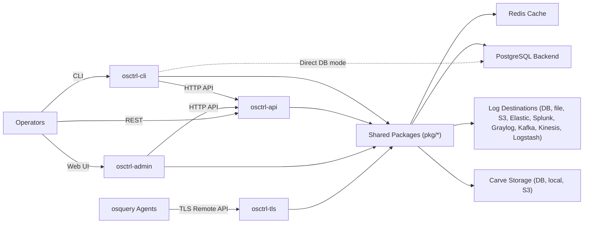

# osctrl

<p align="center">
  
  <p align="center">
    Fast and efficient osquery management.
  </p>
  <p align="center">
    <a href="https://github.com/jmpsec/osctrl/blob/master/LICENSE">
      
    </a>
    <a href="https://github.com/jmpsec/osctrl">
      
    </a>
    <a href="https://goreportcard.com/report/github.com/jmpsec/osctrl">
      
    </a>
  </p>
</p>

## 🤔 What is osctrl?

**osctrl** is a fast and efficient [osquery](https://osquery.io) management solution, implementing its [remote API](https://osquery.readthedocs.io/en/stable/deployment/remote/) as TLS endpoint.

With **osctrl** you can:

- ✨ Monitor all your systems running osquery
- 📦 Distribute its configuration fast
- 📊 Collect all the status and result logs
- ⚡ Run on-demand queries
- 🗂️ Carve files and directories
- ⚙️ Scale from **hundreds to hundreds of thousands of nodes**

> [!WARNING]
> **osctrl** is a fast evolving project, and while it is already being used in production environments, it is still under active development. Please make sure to read the documentation and understand its current state before deploying it in a critical environment.

### 🚀 Why osctrl?

Whether you’re running a small deployment or managing large fleets, **osctrl** gives you visibility and control over your osquery endpoints without compromising security or performance.

## 👉 Documentation

You can find the documentation of the project in [https://osctrl.net](https://osctrl.net)

## 🗂 Project Structure

```text
osctrl/
├── cmd/                         # Service and CLI entrypoints
│   ├── admin/                   # osctrl-admin (web UI + admin handlers/templates/static)
│   ├── api/                     # osctrl-api (REST API service)
│   ├── cli/                     # osctrl-cli (operator CLI)
│   └── tls/                     # osctrl-tls (osquery remote API endpoint)
├── pkg/                         # Shared application packages
│   ├── auditlog/                # Audit log manager
│   ├── backend/                 # DB manager/bootstrap
│   ├── cache/                   # Redis/cache managers
│   ├── carves/                  # File carve logic/storage integrations
│   ├── config/                  # Config structs/flags/validation
│   ├── environments/            # Environment management
│   ├── handlers/                # Shared HTTP handlers
│   ├── logging/                 # Log pipeline + logger backends
│   ├── nodes/                   # Node state/registration/cache
│   ├── queries/                 # Query management/scheduling/results
│   ├── settings/                # Runtime settings
│   ├── tags/                    # Tag management
│   ├── users/                   # User and permissions management
│   ├── utils/                   # Utility helpers
│   └── version/                 # Version metadata
├── deploy/                      # Deployment configs/scripts (docker/nginx/osquery/systemd, CI/CD, redis, config, helpers, etc.)
├── tools/                       # Dev/release helpers and API test assets (Bruno collections, scripts)
├── bin/                         # Built binaries (from make)
├── docker-compose-dev.yml       # Local multi-service development stack
├── Makefile                     # Build/test/dev targets
└── osctrl-api.yaml              # OpenAPI specification for osctrl-api
```

## 🏛 Architecture



## 🛠 Development

The fastest way to get started with **osctrl** development is by using [Docker](https://www.docker.com/) and [Docker Compose](https://docs.docker.com/compose/). But you can find other methods below.

### 🐳 Running osctrl with docker for development

You can use docker to run **osctrl** and all the components are defined in the `docker-compose-dev.yml` that ties all the components together, to serve a functional deployment.

Ultimately you can just execute `make docker_dev` and it will automagically build and run `osctrl` locally in docker, for development purposes.

### 🤖 Using provisioning script

Using the provided `deploy/provision.sh` script, you can set up a development environment on your local machine. This script will install all necessary dependencies and configure the environment for **osctrl** development in a latest Ubuntu LTS system.

Check the [documentation](https://osctrl.net/deployment/natively/) for more details on how to use the provisioning script.

Ultimately the script can also be used to deploy **osctrl** in production systems, please refer to the documentation for more details.

### 🏗 Building from source

To build **osctrl** from source, ensure you have [Go](https://golang.org/dl/) installed (version 1.25 or higher is recommended). Then, clone the repository and run the following commands:

```bash
git clone https://github.com/jmpsec/osctrl.git
cd osctrl
make
```

This will compile all the **osctrl** [components](https://osctrl.net/components/) (`osctrl-tls`, `osctrl-admin`, `osctrl-api`, `osctrl-cli`), placing the binaries in the `bin/` directory.

## 💬 Slack

Find us in the #osctrl channel in the official osquery Slack community ([Request an auto-invite!](https://join.slack.com/t/osquery/shared_invite/zt-1wipcuc04-DBXmo51zYJKBu3_EP3xZPA))

## 📜 License

**osctrl** is licensed under the [MIT License](https://github.com/jmpsec/osctrl/blob/master/LICENSE).

## 🧠 Security & Reporting

This is a security-sensitive project. Please read the `SECURITY.md` for vulnerability reporting and responsible disclosure guidelines.

## 🤝 Contributing

We ❤️ contributions!

Feel free to fork the repository and submit pull requests. For major changes, please open an issue first to discuss what you would like to change.
