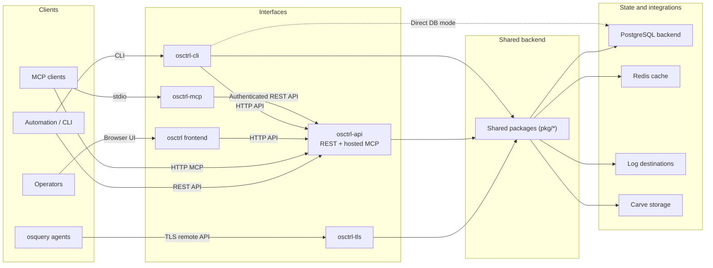

# osctrl

<p align="center">
  
  <p align="center">
    Fast and efficient osquery management.
  </p>
  <p align="center">
    <a href="https://github.com/jmpsec/osctrl/blob/main/LICENSE">
      
    </a>
    <a href="https://github.com/jmpsec/osctrl">
      
    </a>
  </p>
</p>

## What is osctrl?

**osctrl** is a fast and efficient [osquery](https://osquery.io) management solution that implements the [osquery remote API](https://osquery.readthedocs.io/en/stable/deployment/remote/) through a TLS endpoint.

With **osctrl** you can:

- Monitor systems running osquery
- Distribute osquery configuration
- Collect status and result logs
- Run on-demand distributed queries
- Open a read-only, shell-like node console backed by osquery
- Browse node files through accelerated, permission-checked requests
- Carve files and directories
- Alert on log matches and node state through webhook or email channels
- Track node posture, GeoIP country metadata, and node activity
- Check deployment health: database, Redis, services, workers, and upgrade status
- Scale from hundreds to hundreds of thousands of nodes

> [!WARNING]
> **osctrl** is a rapidly evolving project. It is used in production, but remains under active development. Review the documentation and known constraints before deploying it in a critical environment.

### Why osctrl?

Whether you’re running a small deployment or managing large fleets, **osctrl** gives you visibility and control over your osquery endpoints without compromising security or performance.

## Current Highlights

- **Modern operator UI**: React SPA powered by `osctrl-api`, with views for nodes, environments, queries, saved queries, carves, tags, users, enrollment, audit log, service configuration, log sinks, auth providers, alerting, node activity, and optional posture data.
- **Node console**: Read-only console for a specific node using hidden accelerated distributed queries. It supports shell-like commands such as `pwd`, `cd`, `ls`, `stat`, `ps`, `sql`, `osquery`, `.tables`, and `get` for permission-checked file carves.
- **File explorer**: Accelerated per-node directory listing and stat requests backed by osquery distributed queries.
- **Accelerated distributed queries**: Optional osquery accelerated query reads, defaulting to a 5 second interval when enabled. Console acceleration is scoped to the target node and fresh active console sessions.
- **osquery schema awareness**: Ships osquery table metadata through 5.23.1 and exposes authenticated table metadata to the UI/API for query authoring and console `.tables`.
- **Security-sensitive API defaults**: JWT authentication by default for `osctrl-api`, optional multi-factor authentication (TOTP, passkeys/security keys, recovery codes) for password logins, trusted proxy controls, audit logging, and authenticated access to query/carve sample libraries.
- **Model Context Protocol**: A standalone `osctrl-mcp` stdio server and an optional hosted `/api/v1/mcp` endpoint expose permission-checked fleet inspection tools to MCP clients. Mutating tools are separately gated and disabled by default.
- **Alerting**: Optional rule-based alerting on result/status/query logs and node state (inactive/recovered), scoped globally, per environment, or to a single node. Notifications fan out to webhook and email channels with Redis-backed cooldown/dedupe, dispatched history, and hot reload without a restart. Rules can be created straight from a node's page, and a node shows a marker when any rule covers it.
- **Posture and enrichment hooks**: Optional posture ingestion from scheduled query prefixes, optional MaxMind GeoIP country enrichment, Redis-backed activity tracking, and API-managed service configuration sections.
- **Health / system status**: Optional deployment health page behind `--health-enabled` (disabled by default), fusing a live database ping, a Redis PING, per-service runtime stats, an `osctrl-tls` heartbeat, and cached upgrade status.

## Documentation

The published project documentation is available at [docs.osctrl.net](https://docs.osctrl.net). Repository-level references include [ARCHITECTURE.md](./ARCHITECTURE.md), [MCP.md](./MCP.md), and the [identity-provider guide](./docs/auth-providers.md).

## Project Structure

```text
osctrl/
├── cmd/                         # Service and CLI entrypoints
│   ├── api/                     # osctrl-api (REST API service + generated docs)
│   ├── cli/                     # osctrl-cli (operator CLI)
│   ├── mcp/                     # osctrl-mcp (standalone MCP stdio server)
│   └── tls/                     # osctrl-tls (osquery remote API endpoint)
├── frontend/                    # React SPA frontend for the operator UI
├── pkg/                         # Shared application packages
│   ├── activity/                # Redis-backed node/environment activity tracking
│   ├── alerts/                  # Alert rules/channels, log+node-state matcher, dispatch worker
│   ├── auditlog/                # Audit log manager
│   ├── auth/                    # Shared OIDC/SAML auth state and provider helpers
│   ├── authproviders/           # Persisted federated auth provider configs (OIDC, SAML)
│   ├── backend/                 # DB manager/bootstrap + health canary
│   ├── cache/                   # Redis, typed JSON, and in-memory cache helpers
│   ├── carves/                  # File carve logic/storage integrations
│   ├── config/                  # Config structs/flags validation
│   ├── console/                 # Node console sessions/commands/parser
│   ├── dbutil/                  # Database query helpers
│   ├── environments/            # Environment management, packages, and cache
│   ├── fileexplorer/            # Accelerated per-node file explorer
│   ├── filequery/               # File query helpers
│   ├── geoip/                   # MaxMind GeoIP enrichment
│   ├── health/                  # Deployment health: service heartbeats, component status
│   ├── handlers/                # Shared HTTP handler helpers (query/carve targeting)
│   ├── logging/                 # Log pipeline, readers, and logger backends
│   ├── logsinks/                # Per-environment persisted log sink configs
│   ├── mfa/                     # TOTP, WebAuthn, and recovery-code second factors
│   ├── mcp/                     # MCP tools shared by standalone and hosted servers
│   ├── nodes/                   # Node state/registration/cache
│   ├── osquery/                 # osquery schema/table metadata helpers
│   ├── posture/                 # Optional posture ingestion, storage, and scoring
│   ├── queries/                 # Query management/scheduling/results/cache
│   ├── ratelimit/               # HTTP rate limiting helpers
│   ├── servicecommands/         # Service restart and hot-reload command handoff
│   ├── serviceconfig/           # Persisted service configuration sections
│   ├── settings/                # Runtime settings + Redis-backed cache
│   ├── tags/                    # Tag management
│   ├── types/                   # Shared type definitions
│   ├── users/                   # User and permissions management
│   ├── utils/                   # Utility helpers
│   └── version/                 # Version metadata
├── deploy/                      # Deployment configs/scripts (docker/nginx/osquery/systemd, CI/CD, redis, config, helpers, etc.)
├── tools/                       # Dev/release helpers (OpenAPI, Bruno, packages, load/debug tools)
├── bin/                         # Built binaries (from make)
├── docker-compose-dev.yml       # Local multi-service development stack
├── Makefile                     # Build/test/dev targets
└── osctrl-api.yaml              # OpenAPI specification for osctrl-api
```

## Architecture


```mermaid
flowchart LR
    subgraph Clients["Clients"]
        Agents["osquery agents"]
        Ops["Operators"]
        Tools["Automation / CLI"]
        MCPClients["MCP clients"]
    end

    subgraph Interfaces["Interfaces"]
        TLS["osctrl-tls"]
        Frontend["osctrl frontend"]
        API["osctrl-api<br/>REST + hosted MCP"]
        CLI["osctrl-cli"]
        MCP["osctrl-mcp"]
    end

    subgraph Core["Shared backend"]
        Shared["Shared packages (pkg/*)"]
    end

    subgraph Data["State and integrations"]
        DB["PostgreSQL backend"]
        Redis["Redis cache"]
        Logs["Log destinations"]
        Carves["Carve storage"]
    end

    Agents -->|TLS remote API| TLS
    Ops -->|Browser UI| Frontend
    Tools -->|REST API| API
    Tools -->|CLI| CLI
    MCPClients -->|stdio| MCP
    MCPClients -->|HTTP MCP| API

    Frontend -->|HTTP API| API
    CLI -->|HTTP API| API
    MCP -->|Authenticated REST API| API

    TLS --> Shared
    API --> Shared
    CLI --> Shared

    Shared --> DB
    Shared --> Redis
    Shared --> Logs
    Shared --> Carves
    CLI -.->|Direct DB mode| DB
```

## Development

The fastest way to get started with **osctrl** development is by using [Docker](https://www.docker.com/) and [Docker Compose](https://docs.docker.com/compose/). But you can find other methods below.

### Docker development

The root `docker-compose-dev.yml` runs nginx, the frontend, API, TLS service, CLI bootstrap, PostgreSQL, Redis, and sample osquery clients.

Prepare the local environment and certificate before the first build:

```bash
cp .env.example .env
make docker_dev_certs
make docker_dev_build
make docker_dev_up
```

The docker development stack exposes:

- `https://localhost:8444` for the frontend

For the complete stack workflow, endpoints, logs, and reset commands, see [deploy/docker/README.md](./deploy/docker/README.md). For frontend-only development, see [frontend/README.md](./frontend/README.md).

### Runtime and tooling versions

- Go module target: **Go 1.26.5**
- Backend stack: **GORM** (PostgreSQL/MySQL/SQLite), **go-redis**, **zerolog**, **Viper** (YAML config), **urfave/cli**, **Prometheus client**, **JWT/SAML/OIDC auth**, **go-webauthn** (passkeys & security keys), **AWS SDK v2** (S3 + Kinesis), **franz-go** (Kafka), **Elasticsearch v8**, **MaxMind GeoIP**
- Frontend runtime: **Node.js 22+**
- Frontend stack: **React 19**, **TypeScript 7**, **Vite 8**, **Tailwind CSS 4**, **TanStack Router/Query/Table**, **zod 4**, **Monaco Editor**
- Frontend testing: **Vitest 4**, **@testing-library/react 16**, **jsdom 30**, **Playwright 1**
- osquery schema data included through **osquery 5.23.1**
- Default database/cache stack: **PostgreSQL** and **Redis**

### Provisioning script

The `deploy/provision.sh` script installs dependencies and configures an `osctrl` deployment on supported Ubuntu systems.

Check the [documentation](https://docs.osctrl.net/deployment/natively/) for more details on how to use the provisioning script.

The script can also provision production systems; review every generated credential and service configuration before exposing the deployment.

### Building from source

To build **osctrl** from source, ensure you have [Go](https://golang.org/dl/) installed (version 1.26.5 is recommended). Then, clone the repository and run the following commands:

```bash
git clone https://github.com/jmpsec/osctrl.git
cd osctrl
make build
```

This will compile all the **osctrl** [components](https://docs.osctrl.net/components/) (`osctrl-tls`, `osctrl-api`, `osctrl-cli`, `osctrl-mcp`), placing the binaries in the `bin/` directory.

The default `make`/`make build` target also builds the frontend bundle. If you are working on the operator UI directly, the frontend SPA lives in `frontend/` and can be run with `make frontend-dev` or `cd frontend && npm run dev`.

Build only the standalone MCP server with `make mcp`.

### Model Context Protocol

MCP clients can connect in either of two modes:

- `osctrl-mcp` is a cross-platform stdio binary launched by an MCP client. It calls `osctrl-api` with `OSCTRL_API_URL` and `OSCTRL_API_TOKEN`, and inherits that token's environment permissions.
- `osctrl-api` can host MCP over HTTP at `/api/v1/mcp`. Enable it with `mcp.enabled: true` in `api.yml`; `mcp.allowWrites` remains `false` unless mutating tools are explicitly required.

Use a dedicated, narrowly scoped service-user token for the standalone server. Fleet values returned by monitored endpoints are untrusted data, and write tools should only be enabled for trusted operators and deliberate workflows.

See [MCP.md](./MCP.md) for the complete tool list, authentication model, and client configuration examples.

### Release binaries and packages

Tagged releases publish platform archives for `osctrl-tls`, `osctrl-api`, and `osctrl-cli`, plus standalone `osctrl-mcp` binaries for Linux, macOS, and Windows on amd64 and arm64. Continuous builds from `main` and `develop` retain the MCP binaries as downloadable workflow artifacts.

Linux releases also include DEB and RPM packages for `osctrl-tls`, `osctrl-api`, and `osctrl-cli`. The TLS and API packages install:

- the executable under `/opt/osctrl/bin`
- an editable configuration and `.yml.example` under `/opt/osctrl/config`
- a generated systemd unit under `/usr/lib/systemd/system`

Package installation creates the unprivileged `osctrl` account and reloads systemd. Review the database credentials, API JWT secret, and other deployment-specific settings before enabling a service:

```bash
sudo systemctl enable --now osctrl-tls.service
sudo systemctl enable --now osctrl-api.service
```

Configuration files use package-manager `noreplace` semantics, so upgrades preserve operator changes. Services are stopped and disabled on package removal; the shared `osctrl` account is retained for other installed components.

## Slack

Find us in the #osctrl channel in the official osquery Slack community ([Request an auto-invite!](https://join.slack.com/t/osquery/shared_invite/zt-1wipcuc04-DBXmo51zYJKBu3_EP3xZPA))

## License

**osctrl** is licensed under the [MIT License](https://github.com/jmpsec/osctrl/blob/main/LICENSE).

## Security and Reporting

This is a security-sensitive project. Read [SECURITY.md](./SECURITY.md) for vulnerability reporting and responsible disclosure guidelines.

## Contributing

Contributions are welcome. Read [CONTRIBUTING.md](./CONTRIBUTING.md) for the current development and pull-request workflow. For substantial changes, open an issue first to discuss the approach and compatibility impact.
